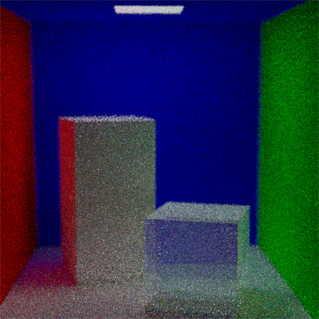

## build 
run
```cmake --build .```
 
from the ./build directory 

## cmake quickstart
https://code.visualstudio.com/docs/cpp/cmake-quickstart

## if fucking thing breaks and you have to set one compiler:
cmake -G Ninja -DCMAKE_C_COMPILER=clang-cl -DCMAKE_CXX_COMPILER=clang-cl ..

## I fucking love code
https://github.com/Dav1dde/glad/issues/186

## it does work with diffuse and glass (~120 spp)

